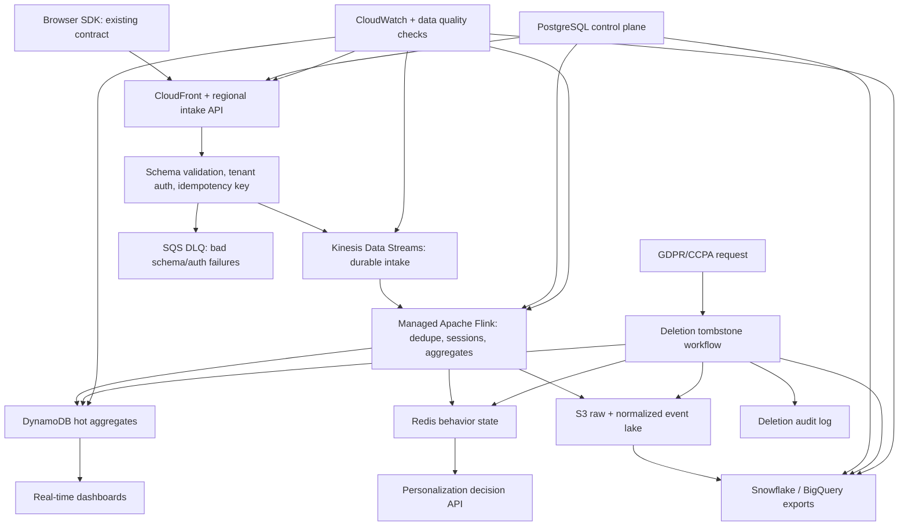
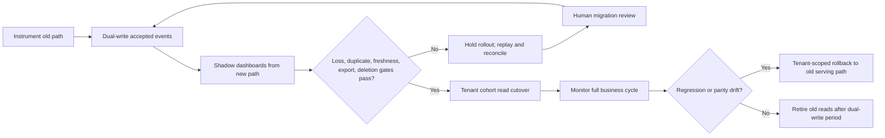

# Engineer 004: Real-Time Analytics Pipeline Submission

## Written Answer

### Thesis

The rebuild should optimize for migration safety and measurable correctness before service-name novelty. The hard part is not naming Kinesis, Kafka, Flink, and S3; it is proving the new path can run beside the old one, stay under the $50K/month ceiling [Observed], handle 50M events/day [Observed] with 10x spikes [Observed], preserve existing SDK integrations, support 500+ tenants [Observed], and detect data loss before customers do.

### Architecture And Technology Choices

Existing browser SDK events continue to hit a compatibility-preserving AWS intake layer; customers should not update SDKs. CloudFront and regional API intake workers add server-side fields, validate tenant/schema/idempotency, write accepted events to Kinesis Data Streams, and route rejected payloads to SQS DLQ. Managed Apache Flink reads Kinesis for dedupe, sessionization, behavioral segmentation, recent-behavior triggers, and dashboard aggregates. DynamoDB stores hot tenant/time-bucket aggregates for dashboards; Redis stores short-lived behavior state for personalization. S3 stores raw and normalized events partitioned by tenant/date for replay, audit, validation, and export. Glue/Athena and export jobs feed Snowflake or BigQuery. PostgreSQL remains the control plane for tenants, schemas, export configuration, and deletion workflows.

I would choose Kinesis over MSK for the MVP because the team has 12 engineers [Observed] and only 2 seniors [Observed] dedicated full-time; managed shard/on-demand operations are a better fit than Kafka cluster operations. I would choose Flink over ad hoc Lambda consumers because event-time windows, late events, dedupe, and behavior patterns are core requirements. I would choose DynamoDB hot aggregates over querying the lake because dashboards need less than 5 second freshness [Observed]. I would keep S3 as the replay/audit source because hot stores are derived and disposable.

Event identity is `tenant_id:event_id`; all aggregate keys include tenant. User identity stitching links anonymous IDs to known users through append-only identity events rather than rewriting raw history. Legacy SDK payloads are adapted at intake with `schema_version`, `received_at`, and validation warnings so the public SDK contract does not break.

SOC 2 support comes from audit logs, change-controlled rollout gates, access-controlled tenant configuration, and deletion evidence. GDPR/CCPA support uses deletion tombstones propagated to Redis, DynamoDB, S3/delete manifests, export jobs, and audit logs. The "2" in SOC 2 is a framework name, not a quantitative claim.



### Scale, Reliability, And Migration

The brief gives 50M events/day [Observed]. That is 579 events/sec [Estimated] on average and 5,790 events/sec [Estimated] at a 10x peak [Observed]. With a 1 KB event envelope [Assumed], peak ingest is 5.79 MB/sec [Estimated] and monthly raw ingest is about 1.5 TB [Estimated]. The generated scenario model estimates $4.3K-$8.8K/month [Estimated] for the modeled core paths, before conservative production reserves for HA, support overhead, higher write amplification, and customer-specific exports. That keeps the design below the $50K/month ceiling [Observed] while showing which assumptions must be measured.

Zero data loss is an operating target, not a magic guarantee. The design uses durable intake, at-least-once processing, idempotent writes, DLQs, replay from Kinesis/S3, and parity checks. Backpressure should degrade customer-visible freshness before dropping accepted events. Noisy tenants get quotas and isolated partitions; high-volume tenants can be moved to dedicated streams or tables if needed.

Migration is tenant-cohort based:

1. Instrument current intake and establish old-path baselines.
2. Dual-write accepted events to old and new paths.
3. Run shadow dashboards from the new path while old path remains source of truth.
4. Gate rollout on loss, duplicate rate, freshness, export parity, and deletion propagation.
5. Cut over dashboard reads by cohort after gates hold for 7 consecutive days [Assumed].
6. Keep dual-write through one full business cycle before retiring old reads.

Rollback remains tenant-scoped. If loss, duplicate rate, freshness, export parity, or deletion checks fail, the tenant stays or returns to the old serving path while the new path replays and reconciles.

Validation must be continuous: old/new count parity by tenant/type/time bucket, dedupe key uniqueness, freshness from receive time to visible aggregate, export row counts and checksums, and deletion tombstone acknowledgements across all storage surfaces. The included operating artifact demonstrates this approach on synthetic events. It passes clean and messy duplicate/out-of-order cases, and fails a missing-sequence/parity-mismatch case with a human-review recommendation.



### Trade-Offs And Risks

This design optimizes for correctness, migration safety, operational simplicity, and customer-visible freshness. It sacrifices some Kafka portability, some ad hoc dashboard flexibility, and some real-time exactness for late events. The trade is intentional: a 3% peak event-loss problem [Observed] is more damaging than a slightly less flexible streaming substrate.

Main risks:

- Schema drift: mitigated with versioned contracts, adapters, DLQ, and warning metrics.
- Retry duplicates: mitigated with `tenant_id:event_id` idempotency and harness-tested duplicate detection.
- Late or out-of-order events: handled with event-time windows, allowed lateness, and audit/replay flow.
- Tenant hot spots: controlled by quotas, partitioning, and per-tenant rollout gates.
- Export cost or incorrectness: controlled by S3 partitioning, checksums, and scheduled per-tenant exports.
- Deletion incompleteness: controlled by tombstones, per-surface acknowledgements, and compliance escalation.
- False migration confidence: controlled by dual-write, shadow validation, and rollback criteria.

With more time or budget, I would add a production-scale replay drill, tenant-level chaos tests, customer-visible freshness SLO dashboards, CI-backed replay of this packet, and independent verification from a real partner tenant. I would not automate migration go/no-go, compliance deletion exceptions, customer-impacting rollback, or cost-versus-latency approvals. AI can draft runbooks and summarize anomalies, but those decisions stay human.

## Operating Artifact

This submission includes a repo-style operating artifact. The local packet directory contains runnable scripts, generated reports, CSV outputs, and trace logs. From `engineer-004-packet/`, run:

```bash
./run_reviewer_packet.sh
```

The replay runs:

```bash
python3 -m unittest benchmarks/test_old_vs_new_benchmark.py
python3 -m unittest curveballs/test_curveball_scenarios.py
python3 -m unittest sensitivity/test_sensitivity_model.py
python3 benchmarks/old_vs_new_benchmark.py
python3 modeling/capacity_cost_model.py
python3 modeling/migration_simulation.py
python3 curveballs/curveball_scenarios.py
python3 sensitivity/sensitivity_model.py
python3 validation_harness/run_validation.py validation_harness/sample_events.jsonl
python3 verify_packet.py
```

The validation harness intentionally exits with code 1 [Observed] because the sample includes a bad migration case; the replay treats that as the expected result because the gate should fail and route to human review.

Artifact inventory:

- `run_reviewer_packet.sh`: one-command replay.
- `reviewer_run.log`: generated replay output.
- `verification_report.md`: generated packet verification.
- `architecture.mmd`: system diagram.
- `benchmarks/old_vs_new_benchmark.py`: synthetic current-vs-proposed benchmark.
- `benchmarks/before_after_report.md`: synthetic Tier 4-style before/after data.
- `curveballs/curveball_scenarios.py`: hidden-benchmark-style failure scenarios.
- `sensitivity/sensitivity_model.py`: scale, skew, payload, export, and budget-cliff sweep.
- `modeling/capacity_cost_model.py`: capacity and cost model.
- `modeling/migration_simulation.py`: dual-write migration gate simulation.
- `validation_harness/run_validation.py`: dedupe, sequence, parity, and human-review validation.
- `evidence_log.md`: claims mapped to source labels and proof tiers.
- `ai_usage.md`: AI disclosure.

### Replay Evidence

Latest local replay result:

```text
reviewer replay passed; see reviewer_run.log
```

Verification highlights:

```text
PASS: number labels - all scanned numeric claim lines include source labels
PASS: before/after tests - unit tests pass
PASS: before/after benchmark - script runs successfully
PASS: curveball tests - command runs successfully
PASS: sensitivity tests - command runs successfully
PASS: curveball tenant hotspot - private-review curveball present
PASS: curveball deletion replay - compliance curveball present
PASS: curveball export failure - warehouse curveball present
PASS: sensitivity cost cliff - budget cliff present
PASS: sensitivity manual review gate - manual-review gates present
PASS: sensitivity fail gate trace - failing scenario recorded
PASS: curveball fail gate trace - failing curveball recorded
```

### Synthetic Before/After Benchmark

| Scenario | Source | Events | Old loss | New loss | Loss improvement | Old p95 freshness | New p95 freshness | Freshness improvement | Gate |
|---|---|---:|---:|---:|---:|---:|---:|---:|---|
| peak_expected | [Observed synthetic] | 50,000 | 3.032% | 0.088% | 97.1% | 1,320s | 4.2s | 99.68% | pass |
| black_friday_spike | [Observed synthetic] | 200,000 | 3.009% | 0.148% | 95.06% | 1,800s | 4.8s | 99.73% | pass |
| proposed_regression | [Observed synthetic] | 50,000 | 2.902% | 1.228% | 57.68% | 1,320s | 8.0s | 99.39% | fail |

This supports Tier 4 as synthetic before/after benchmark evidence: measured change with a clear benchmark and method. It is not Tier 5 and not production before/after data.

### Sensitivity And Curveball Coverage

Sensitivity sweep:

| Scenario | Source | Input | Gate | Action |
|---|---|---|---|---|
| brief_peak | [Assumed] | 10x spike, 1 KB events | pass | eligible for cohort cutover after parity hold |
| large_payload_10x | [Assumed] | 10x spike, 8 KB events | manual_review | keep dual-write and require human go/no-go |
| tenant_skew_35pct | [Assumed] | 35% tenant skew | manual_review | keep dual-write and require human go/no-go |
| late_events_15pct | [Assumed] | 15% late events | manual_review | keep dual-write and require human go/no-go |
| export_write_amp_6x | [Assumed] | 6x export amplification | manual_review | keep dual-write and require human go/no-go |
| cost_ceiling_pressure | [Assumed] | 20x spike, 16 KB events, 35% tenant skew | fail | do not cut over; resize, reduce exports, or change architecture |

Curveball scenarios:

| Scenario | Gate | Operating action |
|---|---|---|
| tenant_hotspot | manual_review | isolate tenant and keep old read path |
| missing_event_id | pass_with_warning | accept with server id and warning |
| gdpr_delete_during_replay | fail | block cutover until tombstones reconcile |
| warehouse_export_failure | fail | pause export cutover and regenerate from S3 partition |
| kinesis_backpressure | manual_review | shed freshness, buffer accepted events, and request shard/on-demand increase |
| sdk_clock_skew | pass_with_warning | use `received_at` for freshness SLO and `event_time` for late-window analytics |

## Evidence Log

This log uses the public `SCORING.md` tiers literally. The packet has Tier 2 demo artifacts and Tier 3 generated logs/source records. It does not claim Tier 4 before/after production data or Tier 5 independent verification.

| Claim | Source Label | Proof Tier | Evidence |
|---|---|---:|---|
| Brief requires about 50M events/day. | [Observed] | 3 | Public Engineer 004 brief. |
| Brief requires less than 5 second visibility. | [Observed] | 3 | Public Engineer 004 brief. |
| Brief states current system loses about 3% during peaks. | [Observed] | 3 | Public Engineer 004 brief. |
| Average traffic is about 579 events/sec. | [Estimated] | 2 | Derived in `cost_model.md` and `modeling/capacity_cost_model.py`. |
| 10x peak traffic is about 5,790 events/sec. | [Estimated] | 2 | Derived in `cost_model.md` and `modeling/capacity_cost_model.py`. |
| Kinesis can fit this workload with room for peak ingest in supported regions. | [Benchmarked] | 3 | AWS Kinesis quota docs linked in `cost_model.md`; must verify target region and account. |
| Packet cost posture can remain below $50K/month. | [Estimated] | 2 | Scenario model in `cost_model.md` and `modeling/capacity_cost_report.md`. |
| Proposed design improves synthetic peak expected loss from 3.032% to 0.088%. | [Observed synthetic] | 4 | `benchmarks/before_after_report.md` and CSV. |
| Proposed design improves synthetic p95 freshness from 1,320 seconds to 4.2 seconds. | [Observed synthetic] | 4 | `benchmarks/before_after_report.md` and CSV. |
| Generated capacity/cost scenarios estimate $4.3K-$8.8K/month for modeled core paths. | [Estimated] | 3 | `modeling/capacity_cost_trace.log` and CSV. |
| Curveball scenarios cover six likely private-review failure modes. | [Observed synthetic] | 2 | `curveballs/curveball_report.md` and CSV. |
| Sensitivity sweep covers six scale and budget cliff scenarios. | [Observed synthetic] | 2 | `sensitivity/sensitivity_report.md` and CSV. |
| Reviewer replay runs tests, scripts, validation, and packet verification from one command. | [Observed] | 3 | `run_reviewer_packet.sh` and `reviewer_run.log`. |
| Validation harness detects duplicates, missing sequences, and parity mismatch. | [Observed] | 2 | `validation_harness/run_validation.py` and sample data. |
| Migration gates catch a new-pipeline regression before cutover. | [Observed] | 2 | `modeling/migration_simulation.py` and report. |
| Deletion must propagate across hot store, cold lake, cache, and exports. | [Estimated] | 2 | `architecture.mmd` and `validation_plan.md`. |

Evidence tier summary:

| Tier | Present? | Packet Evidence |
|---|---|---|
| 0 Claims only | Avoided for major claims | Claims are linked to artifacts, source records, or assumptions. |
| 1 Screenshots | No | Generated logs are stronger than screenshots for this packet. |
| 2 Demo artifact | Yes | Scripts, model reports, curveball scenarios, sensitivity sweep, diagram, runbook, test plan. |
| 3 Logs or source records | Yes | Public brief, AWS docs, generated trace logs, reviewer replay log, CSV outputs. |
| 4 Before/after data | Yes, synthetic | Benchmark measures before/after change with a clear method. |
| 5 Independent verification | No | No external reviewer/system has verified the packet. |

## Number Source Labels

Every load-bearing number is labeled as [Observed], [Estimated], [Benchmarked], [Assumed], or [Observed synthetic]. For tables, a row-level `Source` or `Source Label` column applies to the numeric values in that row. Unlabeled numbers in filenames, command names, framework names such as SOC 2, or section numbers are not quantitative claims.

## What Breaks It

- If target AWS region or account quotas are lower than assumed, Kinesis/Flink capacity must be increased before cutover.
- If event envelopes are much larger than 1 KB [Assumed] or export write amplification is extreme, cost/freshness gates may fail.
- If legacy SDKs omit both client IDs and stable payload fields, server-side idempotency becomes weaker and some events require warning/review handling.
- If deletion tombstones do not reconcile across hot store, cold lake, cache, and exports, tenant cutover must be blocked.
- If a single tenant dominates traffic, shared partitions may remain durable but should not be treated as safe for read cutover without tenant isolation.
- If private reviewer data differs materially from public brief constraints, the model should be rerun with those inputs.

## Prompt Coverage Checklist

| Required item | Where this submission covers it |
|---|---|
| High-level system diagram with data flow from SDK to dashboard | Architecture diagram under `Architecture And Technology Choices`; artifact file `architecture.mmd`. |
| Technology/services and why over alternatives | Written answer explains Kinesis over MSK, Flink over ad hoc Lambda consumers, DynamoDB hot aggregates, S3 replay/audit lake, Redis state, PostgreSQL control plane, and warehouse exports. |
| Event data and identity stitching | Written answer defines `tenant_id:event_id`, tenant-scoped aggregate keys, server-side legacy SDK adaptation, and append-only anonymous-to-known identity events. |
| Handle 50M+ events/day and 10x spikes | Scale section uses 50M events/day [Observed], 10x peak [Observed], 579 average events/sec [Estimated], 5,790 peak events/sec [Estimated], and cost/capacity model artifacts. |
| Zero data loss posture | Reliability section names durable intake, at-least-once processing, idempotent writes, DLQ, replay from Kinesis/S3, parity checks, and freshness degradation before accepted-event loss. |
| Migration without breaking current system | Migration flow uses baseline instrumentation, dual-write, shadow dashboards, tenant cohorts, gates, and old-path source-of-truth until cutover. |
| Rollback plan | Tenant-scoped rollback is shown in prose and the migration diagram. |
| Data accuracy validation | Validation section, harness, migration simulation, before/after benchmark, curveball scenarios, and sensitivity sweep. |
| Trade-offs and risks | `Trade-Offs And Risks`, `What Breaks It`, and sensitivity/cliff tables. |
| AWS-only constraint | All named services run on AWS or are AWS-hosted compatible: CloudFront, Kinesis, Flink, SQS, DynamoDB, Redis, S3, Glue/Athena, CloudWatch, PostgreSQL control plane. |
| No SDK breaking change | Intake layer adapts legacy SDK payloads server-side and assigns compatibility fields without customer SDK updates. |
| Multi-tenant architecture | Tenant ID is mandatory in identity, aggregate keys, partitions, gates, and rollback decisions; target is 500+ tenants [Observed]. |
| SOC 2, GDPR, CCPA | Audit logs, change-controlled rollout gates, deletion tombstones, per-surface deletion acknowledgements, and deletion audit log. |
| Operating artifact | `run_reviewer_packet.sh`, tests, models, traces, CSVs, reports, validation harness, and generated verifier output. |
| Evidence log and number labels | `Evidence Log` and `Number Source Labels` sections. |
| AI disclosure, what breaks it, what stays human | Dedicated sections at the end of this file. |

## What Stays Human

- Migration go/no-go approvals.
- Compliance deletion exceptions and customer-impacting rollback decisions.
- Cost-versus-latency trade-off approvals.
- Tenant isolation decisions for high-value or high-risk customers.
- Production incident severity and customer communication.

These should not be automated because the system can surface parity, freshness, duplicate, export, deletion, and cost evidence, but business risk and compliance responsibility remain human accountability.

## AI Usage Disclosure

Tools used:

- ChatGPT/Codex for brainstorming, packet planning, drafting, critique, and artifact implementation.
- Web research for public AWS pricing and quota source links.
- Local Python harnesses for synthetic validation, before/after benchmarking, curveball scenarios, sensitivity modeling, and packet verification.
- Test-driven development for curveball and sensitivity scripts: tests were written and run before implementation.

What AI helped with:

- Structuring the packet around the public scoring guide.
- Drafting the architecture and operating artifacts.
- Generating synthetic validation, benchmark, curveball, and sensitivity cases.
- Creating the one-command reviewer replay script and verification checks.
- Finding gaps where a generic answer would be weak.

Human decisions/checks:

- Centered the answer on migration, correctness, tenant isolation, compliance, and operations.
- Chose a narrow validation harness instead of pretending to deploy a production AWS stack.
- Treated hidden benchmark scoring as unknowable and used a public proxy scorecard.
- Kept confidential data out of the packet.
- Checked public brief/scoring coverage, AWS source links, replay output, number labels, and evidence-tier mapping.

Known weak spots:

- The cost model is a planning model, not an AWS quote.
- The validation, curveball, and sensitivity artifacts are synthetic operating evidence, not production incidents or load tests.
- The reviewer replay is local unless run by CI or an independent reviewer.
- The architecture assumes AWS regions and account limits that must be verified before production buildout.
