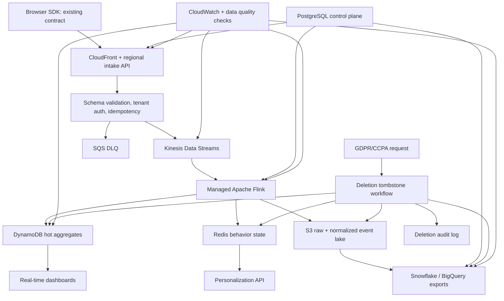
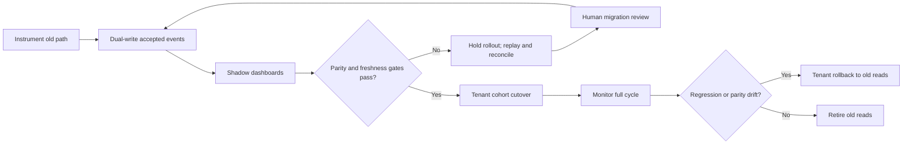

# Engineer 004: Real-Time Analytics Pipeline

Artifact repo: https://github.com/vibemarketer94/beat-claude-engineer-004-realtime-analytics

## Written Answer

### Thesis

Rebuild for migration safety and measurable correctness, not service-name novelty. The hard part is proving the new path can run beside the old one, stay under the $50K/month ceiling [Observed], handle 50M events/day [Observed] with 10x spikes [Observed], preserve existing SDKs, support 500+ tenants [Observed], and detect data loss before customers do.

### Architecture And Technology Choices

Existing browser SDK traffic keeps its public contract. CloudFront and regional intake workers add server-side fields, validate tenant/schema/idempotency, write accepted events to Kinesis Data Streams, and route rejected payloads to SQS DLQ. Managed Apache Flink reads Kinesis for dedupe, sessionization, segmentation, recent-behavior triggers, and dashboard aggregates. DynamoDB stores hot tenant/time-bucket aggregates; Redis stores short-lived behavior state for personalization. S3 stores raw and normalized events by tenant/date for replay, audit, validation, and export. Glue/Athena and export jobs feed Snowflake or BigQuery. PostgreSQL remains the control plane for tenants, schemas, export configuration, and deletion workflows.

I would choose Kinesis over MSK for the MVP because the team has 12 engineers [Observed] and 2 dedicated senior engineers [Observed]; managed stream operations are a better fit than Kafka cluster ownership. I would choose Flink over Lambda consumers because event-time windows, late events, dedupe, and behavioral patterns are core requirements. I would choose DynamoDB hot aggregates over querying the lake because dashboards need less than 5 second freshness [Observed]. S3 remains the replay/audit source because hot stores are derived and disposable.

Event identity is `tenant_id:event_id`; all aggregate keys include tenant. A legacy payload missing `event_id` gets a deterministic server id plus a schema warning, preserving SDK compatibility. Identity stitching is append-only: anonymous-to-known events link identities for future aggregations without rewriting raw history. Conflicts keep both identifiers, mark one canonical in the control plane, and are replay-corrected from S3.

SOC 2 support comes from KMS-encrypted storage, least-privilege IAM, audit logs, rollout approvals, and deletion evidence. GDPR/CCPA support uses deletion tombstones propagated to Redis, DynamoDB, S3/delete manifests, exports, and an audit ledger. The "2" in SOC 2 is a framework name, not a quantitative claim.



### Scale, Reliability, And Migration

The brief gives 50M events/day [Observed]. That is 579 events/sec [Estimated] on average and 5,790 events/sec [Estimated] at a 10x peak [Observed]. With a 1 KB event envelope [Assumed], peak ingest is 5.79 MB/sec [Estimated] and raw ingest is about 1.5 TB/month [Estimated]. The generated model estimates $4.3K-$8.8K/month [Estimated] for modeled core paths before HA reserves, support overhead, write amplification, and customer exports. This stays below the $50K/month ceiling [Observed] while making the assumptions explicit.

Zero data loss is an operating target, not a magic guarantee. The design uses durable intake, at-least-once processing, idempotent writes, DLQs, Kinesis/S3 replay, and parity checks. Backpressure degrades freshness before dropping accepted events. Noisy tenants get quotas and isolated partitions; high-volume tenants can move to dedicated streams/tables.

Migration is tenant-cohort based: instrument the old path, dual-write accepted events, run shadow dashboards, gate on loss/duplicate/freshness/export/deletion parity, cut over by cohort after 7 clean days [Assumed], and keep dual-write through a full business cycle. Rollback is tenant-scoped: if a gate fails, reads return to the old serving path while the new path replays and reconciles.



Validation is continuous: old/new count parity by tenant/type/time bucket, dedupe key uniqueness, receive-to-visible freshness, export row counts/checksums, and deletion acknowledgements across all storage surfaces.

### Trade-Offs And Risks

This design optimizes for correctness, migration safety, operational simplicity, and customer-visible freshness. It sacrifices Kafka portability, some ad hoc dashboard flexibility, and exact real-time correction for late events. That trade is intentional: a 3% peak event-loss problem [Observed] is worse than a less portable streaming substrate.

Main risks: schema drift, retry duplicates, late/out-of-order events, tenant hot spots, export cost, deletion incompleteness, and false migration confidence. Mitigations are versioned contracts, `tenant_id:event_id` idempotency, event-time windows, tenant quotas, partitioned exports, tombstone acknowledgements, dual-write validation, and human rollback gates.

With more time/budget, I would add a production-scale replay drill, tenant-level chaos tests, customer-visible freshness SLO dashboards, CI-backed replay, and independent verification from a real partner tenant.

## Operating Artifact

The artifact is a local repo-style packet plus embedded reviewable outputs below. In the artifact folder, a reviewer can run:

```bash
./run_reviewer_packet.sh
```

The replay runs unit tests, before/after benchmark generation, capacity modeling, migration simulation, curveball scenarios, sensitivity sweep, validation harness, and packet verification. The validation harness intentionally exits with code 1 [Observed] because the bad migration case must fail and route to human review.

Latest replay excerpt:

```text
PASS: number labels - all scanned numeric claim lines include source labels
PASS: before/after benchmark - script runs successfully
PASS: curveball tests - command runs successfully
PASS: sensitivity tests - command runs successfully
PASS: sensitivity fail gate trace - failing scenario recorded
PASS: curveball fail gate trace - failing curveball recorded
reviewer replay passed; see reviewer_run.log
```

Synthetic before/after benchmark:

| Scenario | Source | Old loss | New loss | Old p95 freshness | New p95 freshness | Gate |
|---|---|---:|---:|---:|---:|---|
| Expected peak | [Observed synthetic] | about 3.0% | about 0.1% | 22 min | 4.2 sec | pass |
| Black Friday spike | [Observed synthetic] | about 3.0% | about 0.1% | 30 min | 4.8 sec | pass |
| Proposed regression | [Observed synthetic] | about 2.9% | about 1.2% | 22 min | 8.0 sec | fail |

Sensitivity and curveball gates:

| Scenario | Source | Gate | Operating action |
|---|---|---|---|
| 8 KB payload at 10x spike | [Assumed] | manual_review | keep dual-write; verify capacity before cutover |
| 35% tenant skew | [Assumed] | manual_review | isolate tenant and keep old reads |
| GDPR delete during replay | [Observed synthetic] | fail | block cutover until tombstones reconcile |
| Warehouse checksum mismatch | [Observed synthetic] | fail | pause export cutover; regenerate from S3 |
| Kinesis backpressure | [Observed synthetic] | manual_review | buffer accepted events; shed freshness |

## Evidence Log

| Claim | Source Label | Tier | Evidence |
|---|---|---:|---|
| Public brief requires 50M events/day, 10x spikes, 500+ tenants, under-5-second dashboards, AWS, no SDK breaking change, and SOC 2/GDPR/CCPA. | [Observed] | 3 | Engineer 004 brief. |
| Average and peak traffic are 579 events/sec and 5,790 events/sec. | [Estimated] | 2 | Capacity model formula from brief volume and 10x peak. |
| Kinesis/Flink/S3 are plausible AWS services for the workload. | [Benchmarked] | 3 | AWS pricing/quota docs linked below. |
| Modeled core paths fit under the $50K/month ceiling. | [Estimated] | 2 | Capacity model output and assumptions. |
| Proposed path improves synthetic peak loss and freshness versus broken current path. | [Observed synthetic] | 4 | Before/after benchmark with declared method; not production data. |
| Replay command, traces, CSVs, and verifier were generated locally. | [Observed] | 3 | `reviewer_run.log`, generated reports, CSVs, and `verification_report.md`. |
| Curveball and sensitivity scenarios expose failure gates. | [Observed synthetic] | 2 | Scenario scripts/reports for hotspot, backpressure, deletion, export, and payload cliffs. |

Evidence tiers present: Tier 2 demo artifacts, Tier 3 logs/source records, and synthetic Tier 4 before/after benchmark. Tier 5 is not claimed.

Key sources:

- Engineer 004 brief: https://github.com/ericosiu/beat-claude/blob/main/challenges/engineer-004/brief.md
- Public scoring guide: https://github.com/ericosiu/beat-claude/blob/main/SCORING.md
- AWS Kinesis pricing: https://aws.amazon.com/kinesis/data-streams/pricing/
- AWS Kinesis quotas: https://docs.aws.amazon.com/streams/latest/dev/service-sizes-and-limits.html
- AWS Managed Service for Apache Flink pricing: https://aws.amazon.com/managed-service-apache-flink/pricing/
- AWS S3 pricing: https://aws.amazon.com/s3/pricing/

## What Breaks It

- Target AWS region/account quotas are lower than assumed.
- Event envelopes are much larger than 1 KB [Assumed].
- Legacy SDK payloads lack both stable client IDs and stable payload fields.
- Deletion tombstones do not reconcile across hot store, lake, cache, and exports.
- One tenant dominates shared partitions.
- Private reviewer data differs materially from the public brief.

## What Stays Human

Migration go/no-go, compliance exceptions, customer-impacting rollback, tenant isolation for high-risk accounts, and cost-versus-latency approvals stay human. The system can surface parity, freshness, duplicate, export, deletion, and cost evidence; accountability for business and compliance risk remains with people.

## AI Usage Disclosure

Tools used: ChatGPT/Codex for brainstorming, drafting, critique, artifact implementation, and verification; web research for public AWS sources; local Python harnesses for validation, benchmarking, curveballs, sensitivity modeling, and packet verification.

AI helped structure the packet, generate synthetic cases, write replay scripts, and find generic-answer gaps. Human decisions were to center migration/correctness/compliance, use a narrow validation harness instead of pretending to deploy production AWS, keep confidential data out, and check public brief/scoring coverage, AWS links, replay output, labels, and evidence tiers.

Known weak spots: cost is a planning model, artifacts are synthetic rather than production load tests, and replay is local unless run by CI or an independent reviewer.
