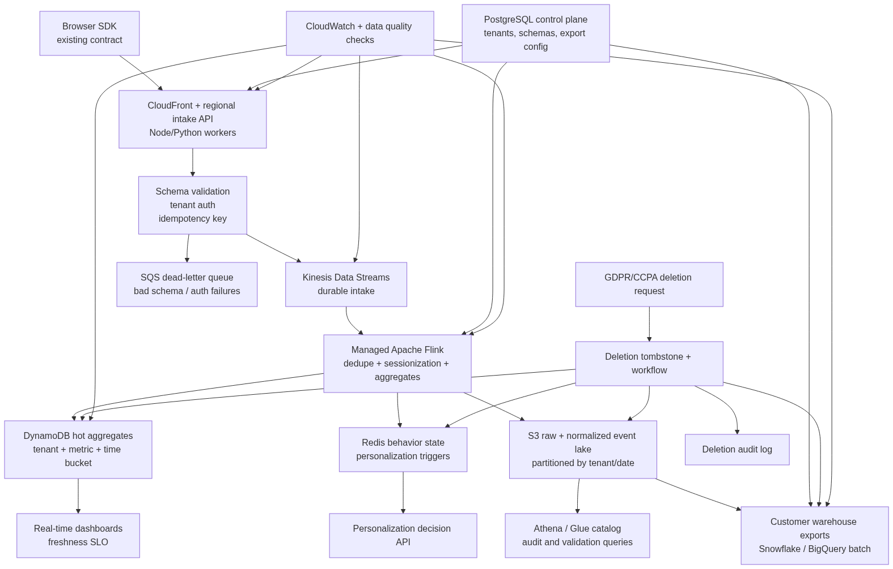

# Engineer 004 Submission Packet

[](https://github.com/vibemarketer94/beat-claude-engineer-004-realtime-analytics/actions/workflows/reviewer-replay.yml)

This packet answers the Beat Claude Engineer 004 challenge: design a real-time analytics pipeline for a martech product with [Observed] 50M events/day, [Observed] 10x spikes, [Observed] less than 5 second dashboard freshness, [Observed] 500+ tenants, warehouse exports, and GDPR/CCPA deletion.

Public artifact repo: https://github.com/vibemarketer94/beat-claude-engineer-004-realtime-analytics

The green badge above means GitHub Actions independently re-ran the full reviewer replay (`./run_reviewer_packet.sh`) in a clean environment — the proof is reproducible off the author's machine, not just locally.

## Architecture



Diagram source: `architecture.mmd`.

## Upload File

**Upload `ENGINEER_004_SUBMISSION_READY.md`** — the canonical submission. The written answer (3 brief sections + delivery plan) is kept within the 4-page limit; the required packet items that follow it (evidence log, number labels, AI disclosure, failure modes, human-decision notes) are explicitly marked as out-of-page-count and link to the artifacts in this repo.

`submission.md` is a longer working draft kept for internal reference. `ENGINEER_004_FULL_SUBMISSION.md` is a superseded earlier draft, not for review.

## Review Order

1. Read `ENGINEER_004_SUBMISSION_READY.md` for the upload-ready answer.
2. Read `operating_artifact.md` for the inspectable engineering artifact index and commands.
3. See `architecture.png` (rendered) or `architecture.mmd` (source) for the system diagram.
4. Run the full reviewer replay:

```bash
./run_reviewer_packet.sh
```

5. Check `challenge_requirements_matrix.md` to see how the prompt is covered.
6. Inspect `cost_model.md` and `modeling/capacity_cost_report.md` for source-labeled sizing and scenario modeling.
7. Inspect `benchmarks/before_after_report.md` for synthetic before/after evidence.
8. Inspect `curveballs/curveball_report.md` and `sensitivity/sensitivity_report.md` for hidden-benchmark-style failure modes.
9. Read `walkthrough.md` if doing a live reviewer walkthrough.
10. Run the packet verifier directly if needed:

```bash
python3 verify_packet.py
```

11. Check `reviewer_scorecard.md`, `verification_report.md`, `reviewer_run.log`, and `evidence_log.md`.

## What "Works" Means

This packet does not deploy an AWS stack. It works when a reviewer can inspect the full answer without credentials, reproduce the synthetic validation harness, and trace major claims to source labels, proof tiers, and artifacts.

Expected harness result: normal and messy cases pass; the failure case fails and recommends human review.

`verify_packet.py` is the broader packet check. It verifies required files, brief coverage terms, source labels on numeric claim lines, harness behavior, expected output, benchmark tests, curveball scenarios, sensitivity cliffs, and required AWS source links.
